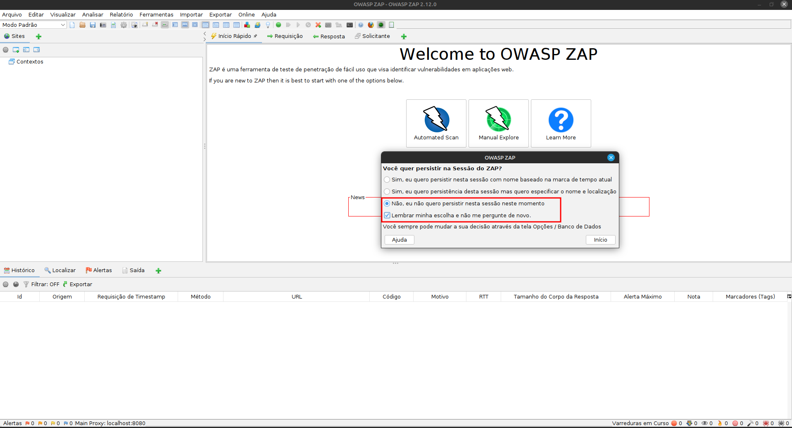
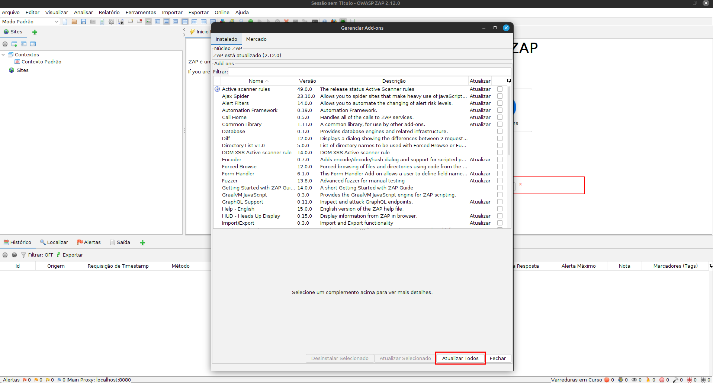
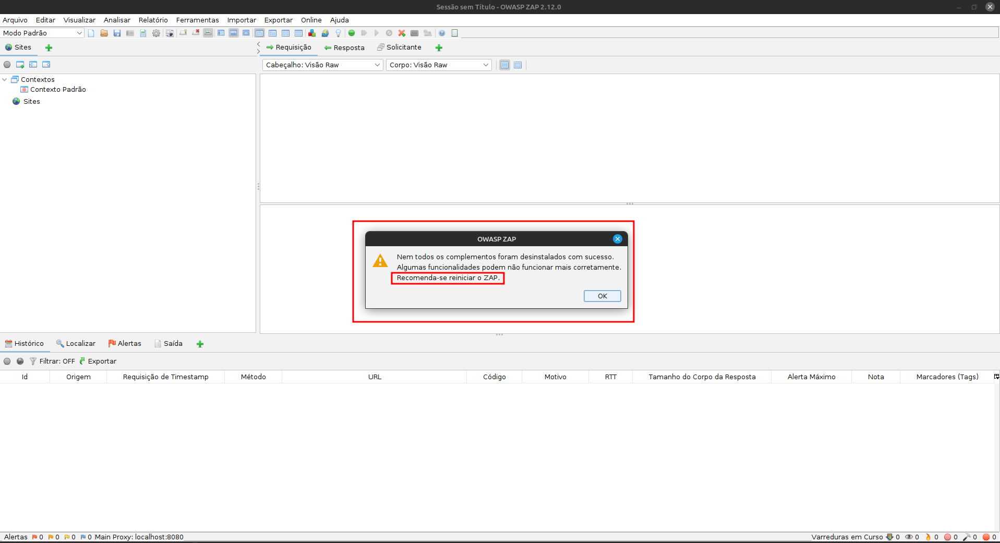

# OWASP Zed Attack Proxy
LEIA: [AVISO LEGAL](AVISO_LEGAL.md)


Teste de segurança utilizando a api do OWASP Zed Attack Proxy

Site oficial do OWASP Zed Attack Proxy  [aqui](https://www.zaproxy.org/).  
Documentação da api do OWASP Zed Attack Proxy [aqui](https://www.zaproxy.org/docs/api/).

## Configurar o projeto
O script abaixo deve baixar a versão 2.14.0 OWASP Zed Attack Proxy e configurar o python.  
`bash setup.sh`

## Execute o OWASP Zed Attack Proxy para a primeira configuração


O ZAP requer uma chave de API para executar ações específicas por meio da API REST.
A chave da API deve ser especificada em todas as 'ações' da API e algumas 'outras' operações.
A chave API é usada para impedir que sites maliciosos acessem APIs ZAP. 

Execute o Zap proxy com o comando:

```
./ZAP_2.14.0/zap.sh -config api.key=2e04c978070fb9756cde6a684a
```

Faça as configurações iniciais e atualizações:





Após instalar as atualizações, reinicie o Zaproxy! 



**Caso queria gerar outra chave de api, utilize o comando abaixo substituindo 'suasenha' pela senha que desejar**

```
echo -n suasenha | shasum -a 512 | cut -c 1-26
```
**Não esqueça de substituir a nova credencial na variável 'apikey' no arquivo `zap.py`.**

Eventualmente você pode executar o Zap proxy em background com o comando abaixo (economiza recursos):

```
./ZAP_2.14.0/zap.sh -daemon -config api.key=2e04c978070fb9756cde6a684a
```

## Executar testes

A varredura ativa tenta encontrar vulnerabilidades potenciais usando
ataques conhecidos contra os alvos selecionados. A varredura ativa é 
um ataque a esses alvos e pode danificá-los. Você NÃO deve usá-lo em 
aplicativos para os quais não tem permissão.

Com o Zap proxy executando em interface ou em daemon execute o script run.sh:  
`bash run.sh https://example.com`

Ao finalizar o teste, verifique o relatório gerado na pasta `Reports`.  
